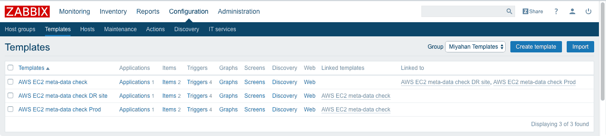
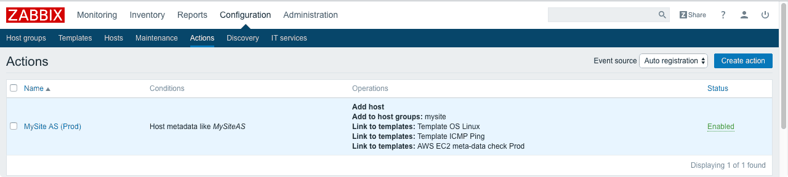
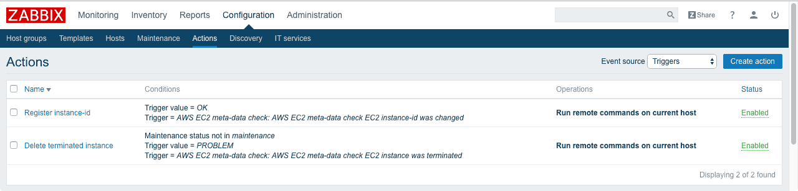
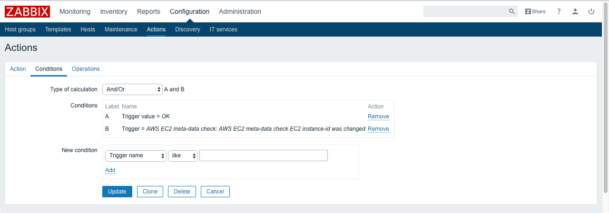
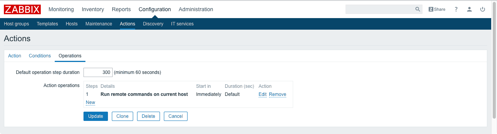
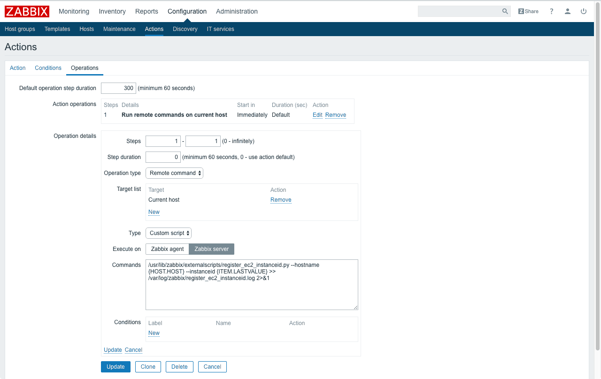
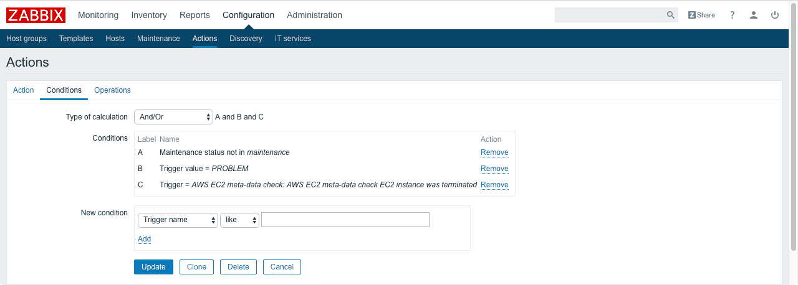
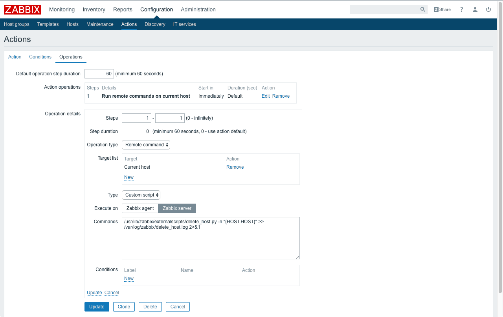

Zabbix EC2 meta-data check
===

Automatically delete host configuration from Zabbix server when in-scaling occurs at AWS EC2.

## Requirements

* Zabbix 3.0
* Python 2.7 or 3.6
* Zabbix remote command must be allowed on each instances


## Install templates & scripts to Zabbix server

1. Import template files (templates/3.0/*.xml) to Zabbix server
1. Place script files (externalscripts/*.py) at externalscripts directory of Zabbix server
    * ref. default directory: `/usr/lib/zabbix/externalscripts/`
1. Modify Zabbix API parameters of `delete_host.py` and `register_ec2_instanceid.py`
    * `ZABBIX_SERVER`: your Zabbix web URL
    * `ZABBIX_USER`: your Zabbix web account username (super admin required)
    * `ZABBIX_PASSWORD` your Zabbix web account password
1. Grant execution privilege to script files
    * eg. `chmod +rx /usr/lib/zabbix/externalscripts/*.py`


## Configure Auto Scaling master AMI

Modify /etc/zabbix/zabbix_agentd.conf

* Enable remote commands: `# EnableRemoteCommands=0` -> `EnableRemoteCommands=1`
* Enable remote log commands: `# LogRemoteCommands=0` -> `LogRemoteCommands=1`
* Modify server address (passive): `ServerActive=127.0.0.1` -> `ServerActive=<YOUR ZABBIX SERVER OR PROXY>`
* Modify server address (active): `ServerActive=127.0.0.1` -> `ServerActive=<YOUR ZABBIX SERVER OR PROXY>`
* Remove hostname: `Hostname=Zabbix server` -> `# Hostname=Zabbix server`
* Enable hostname-item: `# HostnameItem=system.hostname` -> `HostnameItem=system.hostname`
* Set host-metadata: `# HostMetadata=` -> `HostMetadata=<SOMETHING>`


## Setup Zabbix auto registration (for scale-out)

### Fill in template-macros

Fill in following template macros of `AWS EC2 meta-data check`

* `{$REGION}`: EC2 region (eg. `us-east-1`)
* `{$KEY}`: IAM Access key
* `{$SECRET}`: IAM Secret access key

Note: If you separates AWS accounts or region, please make templates and link to `AWS EC2 meta-data check`



### Create auto registration action

* Conditions:
    * Host metadata like <YOUR HOST-METADATA>
* Operations:
    * Add host
    * Link to templates: `AWS EC2 meta-data check` (or child template)
    * and your liking...




## Setup Zabbix auto unregistration (for scale-in)



### Create instance-id registration action

* Conditions:
    * Trigger value = **OK**
    * Trigger = `AWS EC2 meta-data check: AWS EC2 meta-data check EC2 instance-id was changed`
* Operations:
    * Run remote commands on current host
        * Operation type: Remote command
        * Target list: Current host
        * Type: Custom script
        * Execute on: Zabbix **server**
        * Commands:

```sh
/usr/lib/zabbix/externalscripts/register_ec2_instanceid.py --hostname {HOST.HOST} --instanceid {ITEM.LASTVALUE}
```







### Create host deleting action

* Conditions:
    * Maintenance status not in maintenance
    * Trigger value = PROBLEM
    * Trigger = `AWS EC2 meta-data check: AWS EC2 meta-data check EC2 instance was terminated`
* Operations:
    * Run remote commands on current host
        * Operation type: Remote command
        * Target list: Current host
        * Type: Custom script
        * Execute on: Zabbix **server**
        * Commands:

```sh
/usr/lib/zabbix/externalscripts/delete_host.py -n "{HOST.HOST}"
```






## License

* MIT
